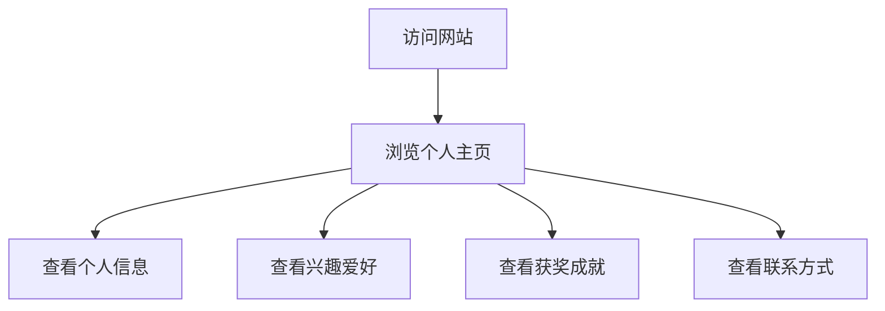

## 1. Product Overview
个人主页网站，展示广东科学技术职业学校商学院学生的个人信息和成就。
- 主要目的是展示个人资料、兴趣爱好和获奖经历，为用户提供一个温馨、治愈的个人展示平台。
- 目标用户为同学、老师和潜在的用人单位，展示个人特色和专业能力。

## 2. Core Features

### 2.1 User Roles (if applicable)
| Role | Registration Method | Core Permissions |
|------|---------------------|------------------|
| Visitor | No registration required | View all content |

### 2.2 Feature Module
1. **Home page**: hero section, personal information, skills & interests, achievements, contact section

### 2.3 Page Details
| Page Name | Module Name | Feature description |
|-----------|-------------|---------------------|
| Home page | Hero section | 展示个人照片和欢迎语，带有温柔的动画效果 |
| Home page | Personal information | 展示学校、专业等基本信息 |
| Home page | Skills & Interests | 展示兴趣爱好（玩游戏、打篮球）和专业技能 |
| Home page | Achievements | 展示广东省商务数据分析大赛冠军等获奖经历 |
| Home page | Contact section | 提供联系方式和社交平台链接 |

## 3. Core Process
用户访问网站 → 浏览个人信息和成就 → 查看联系方式

## 4. User Interface Design
### 4.1 Design Style
- 主色调：柔和的粉色、淡蓝色和米色
- 辅助色：浅紫色和淡绿色
- 按钮风格：圆角设计，带有轻微的阴影效果
- 字体：使用无衬线字体，如Inter，标题使用稍微粗一点的字重
- 布局风格：卡片式布局，带有足够的留白，整体感觉温馨舒适
- 图标风格：使用简约、可爱的线性图标，搭配柔和的颜色

### 4.2 Page Design Overview
| Page Name | Module Name | UI Elements |
|-----------|-------------|-------------|
| Home page | Hero section | 柔和的渐变背景，个人照片使用圆形边框，欢迎语使用大号字体，带有轻微的入场动画 |
| Home page | Personal information | 卡片式设计，白色背景，圆角边框，内部信息排版整洁，使用图标增强视觉效果 |
| Home page | Skills & Interests | 使用图标和进度条展示技能水平，兴趣爱好使用图标和标签形式展示，布局紧凑但不拥挤 |
| Home page | Achievements | 卡片式设计，突出显示广东省商务数据分析大赛冠军的成就，使用徽章和证书样式增强视觉效果 |
| Home page | Contact section | 简洁的联系信息展示，使用图标表示不同的联系方式，底部添加温和的背景图案 |

### 4.3 Responsiveness
- 采用响应式设计，优先考虑桌面端，同时适配平板和移动端
- 在小屏幕设备上，布局会自动调整为单列，确保内容清晰可读
- 触摸优化：增大可点击区域，确保在移动设备上的良好体验

### 4.4 3D Scene Guidance (if applicable)
- 不适用3D场景，保持简约温馨的2D设计风格