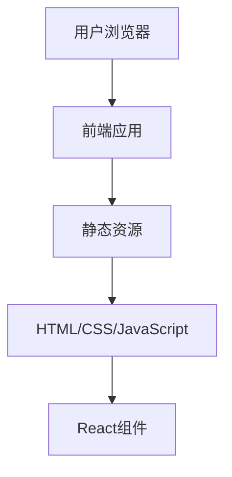

## 1. Architecture Design

## 2. Technology Description
- Frontend: React@18 + tailwindcss@3 + vite
- Initialization Tool: vite-init
- Backend: None (纯前端项目)
- Database: None (纯前端项目)

## 3. Route Definitions
| Route | Purpose |
|-------|---------|
| / | 个人主页，包含所有核心内容 |

## 4. API Definitions (if backend exists)
- 不适用，纯前端项目

## 5. Server Architecture Diagram (if backend exists)
- 不适用，纯前端项目

## 6. Data Model (if applicable)
- 不适用，纯前端项目，所有数据直接硬编码在前端组件中